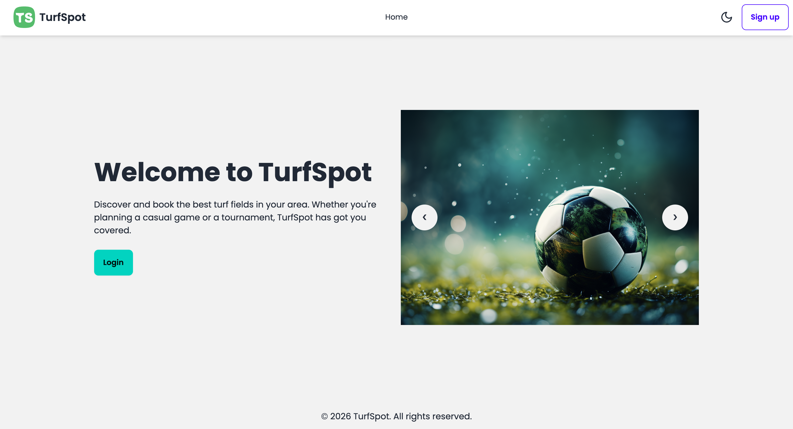
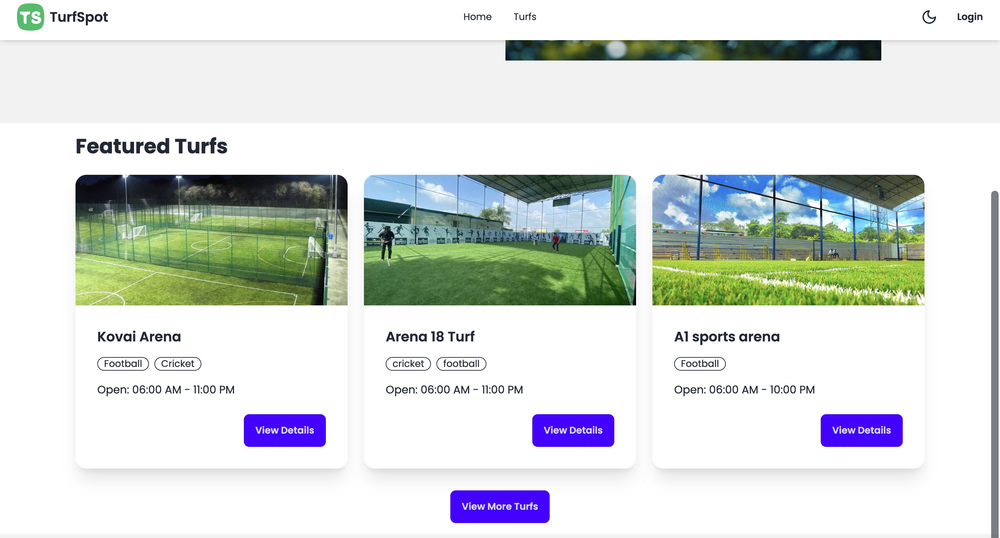
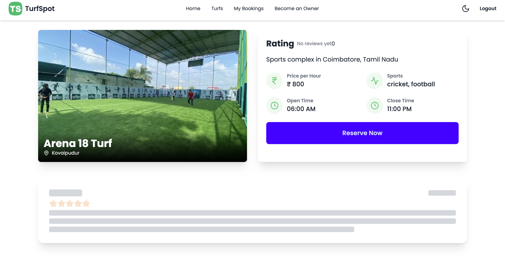
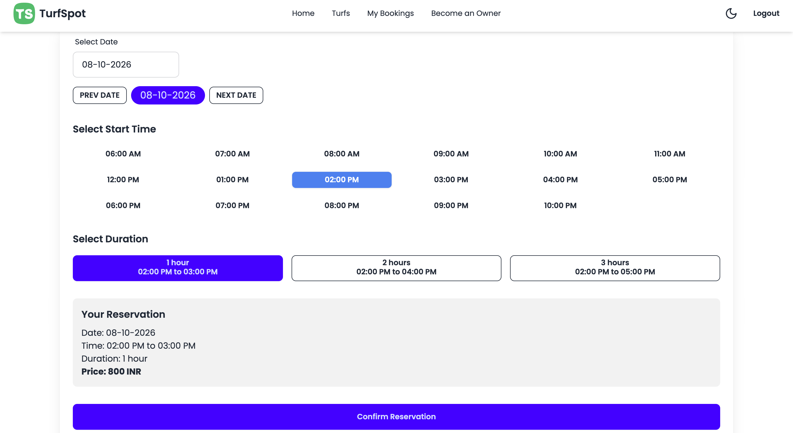
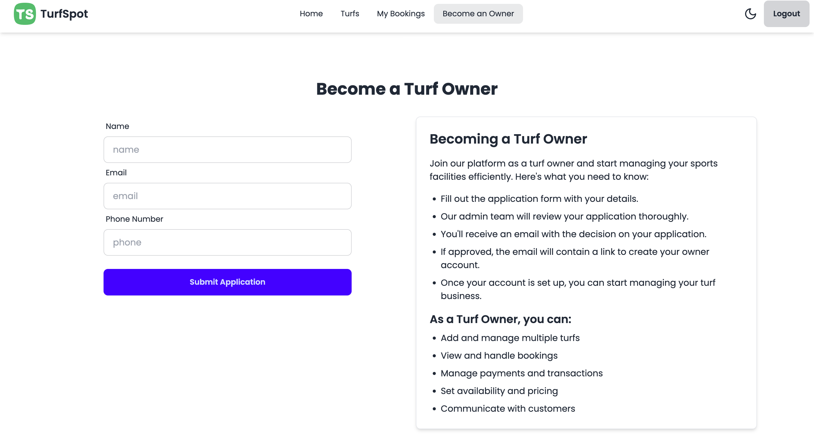

# BookMyTurf

<div align="center">
  
</div>

<br />

**BookMyTurf** is a modern, full-stack software engineering project designed to eliminate double bookings, secure advance payments, and give facility owners complete revenue visibility. It serves as a comprehensive case study for B.Tech CSE Software Engineering & Project Management.

---

## 🚀 Features

- **Smart Slot Booking:** Real-time availability engine prevents conflicting reservations and double-bookings.
- **Advance Payments:** Integrated with Razorpay to secure bookings through upfront payment.
- **Rule-Based Refunds:** Automated calculation and processing of refunds based on cancellation timing.
- **Revenue Intelligence:** Comprehensive dashboard for turf owners to track revenue, bookings, and facility utilization.
- **Interactive Case Study Layer:** Built-in presentation mode and documentation layer featuring UML diagrams, project planning, Gantt charts, risk matrices, and testing analysis.

---

## 📸 Platform Previews

### Engineering Documentation & Case Study
<div align="center">
  
  
</div>

### Project Planning & Risks
<div align="center">
  
  
</div>

---

## 🛠️ Technology Stack

- **Frontend:** React.js, Tailwind CSS, Vite
- **Backend:** Node.js, Express.js
- **Database:** MongoDB
- **Authentication:** JWT, Argon2
- **Payments:** Razorpay API
- **Cloud Storage:** Cloudinary

---

## ⚙️ Local Development Setup

### 1. Prerequisites
- Node.js (v18+)
- MongoDB running locally on port 27017 or a MongoDB Atlas URI

### 2. Installation
Clone the repository and install dependencies for all workspaces:

```bash
# Install Server Dependencies
cd server
npm install

# Install User Client Dependencies
cd ../client/user
npm install

# Install Owner Client Dependencies
cd ../owner
npm install
```

### 3. Environment Variables
Create a `.env` file in the `server` directory with the following variables:

```env
PORT=5000
MONGODB_URI=mongodb://localhost:27017/turfspot
JWT_SECRET=your_jwt_secret_key

CLOUDINARY_CLOUD_NAME=your_cloud_name
CLOUDINARY_API_KEY=your_api_key
CLOUDINARY_API_SECRET=your_api_secret

RAZORPAY_KEY_ID=your_razorpay_key_id
RAZORPAY_KEY_SECRET=your_razorpay_key_secret

EMAIL_USER=your_email@gmail.com
EMAIL_PASS=your_app_password
```

### 4. Database Seeding
To initialize the admin account required for the platform, run the seed script:
```bash
cd server
npm run seed:admin
```
*(Default Admin: admin@gmail.com / admin123)*

### 5. Start the Application
You'll need three terminal windows to run the stack:

```bash
# Terminal 1: Server
cd server
npm run dev

# Terminal 2: User Platform (Includes Case Study)
cd client/user
npm run dev

# Terminal 3: Owner Dashboard
cd client/owner
npm run dev
```

The Case Study and User Platform will be available at `http://localhost:5174`.

---

## 👨‍💻 Author

**Arsheel Patel**  
B.Tech CSE Software Engineering & Project Management Case Study
